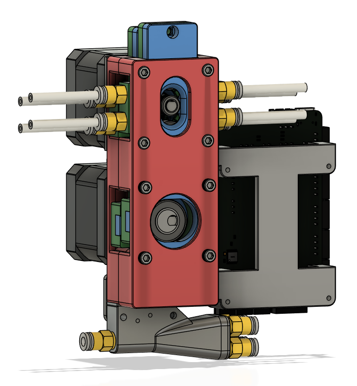
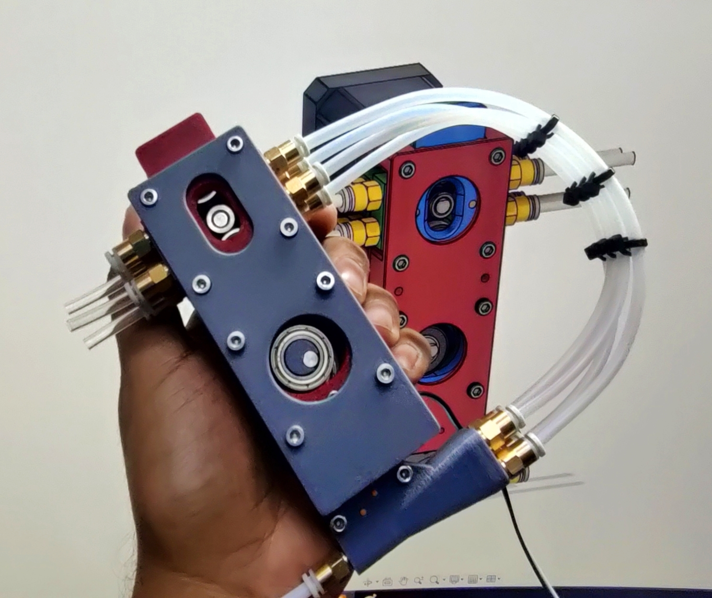
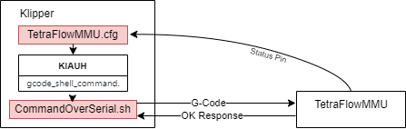

# TetraFlow_MMU
# WIP (Work in Progress)

# NOTE: Design and code is not fully complete. So use with caution, I am looking for collaborators who can test and improve on design and code... #

*TetraFlow MMU*: A Multi-Material Unit for 3D Printers

TetraFlow MMU is a 4-color MMU inspired by the innovative 3dChameleon MMU. Utilizing a unique cam design, it seamlessly switches between filaments. The compact and simple design, thanks to the cam mechanism, includes a 4-to-1 Y splitter with an integrated filament sensor. Additionally, the MMU features homing functionality for precise and reliable filament switching. MMU supports both sensorless homing for TMC (TMC2209) drivers and homing using a limit switch.

    

This is the initial design undergoing refinements. The integration code for 3D printers is still under development.

    

# Interface between Klipper and firmware

    

**G-Code Commands:**

- `<G28>`: Home command. Calls the `home()` function to home the printer.
- `<G1>` or `<G0>`: Movement commands. Extrudes or retracts filament based on the input value. Accepts an optional E variable for filament extrusion/retraction. For example, `<G1 E10>` moves and extrudes filament by 10 units.
- `<G2>`: Arc movement command. Similar to G1 but moves along a curved path in a clockwise direction. Also accepts an optional E variable for filament extrusion.
- `<G900>`: Command to park the tool head. Calls the `parkToolHead()` function.
- `<G901>`: Command to unpark the tool head. Calls the `unParkToolHead()` function.

**T-Code Commands:**

- `<T0>`, `<T1>`, `<T2>`, `<T3>`...: Tool select commands. Changes the selected tool based on the input value. Calls the `UnloadFilament()`, `ToolSelect()`, and `LoadFilament()` functions accordingly.

**S-Code Commands:**

- `<S0>`, `<S1>`, `<S2>`, `<S3>`...: Special tool select commands. Similar to T-Code commands but without filament extrusion. Calls the `ToolSelect()` function.

**O-Code Commands:**

- `<O1>`: Override distance from switch to head. Updates the distance value in the `mmu_setting` object and saves it to EEPROM.
- `<O2>`: Override distance from switch to safe zone. Updates the distance value in the `mmu_setting` object and saves it to EEPROM.
- `<O3>`: Override filament encoder detection length. Updates the value in the `mmu_setting` object and saves it to EEPROM.
- `<O4>`, `<O5>`, `<O6>`, `<O7>`: Override extruder rotation distance for tools T0, T1, T2, T3 respectively. Updates the values in the `mmu_setting` object and saves them to EEPROM.
- `<O8>`: Override stall value for motor A. Updates the stall value in the `mmu_setting` object, sets it in the motor driver, and saves it to EEPROM.

**M-Code Commands:**

- `<M600>`: Unload filament command. Unloads filament using the `UnloadFilament()` function and parks the tool head using the `parkToolHead()` function.

**C-Code Commands:**

- `<C<tool number> V<revolutions>>`: Calibrate E steps for the specified tool number and revolutions. Calls the `CalibrateESteps()` function.

# Demo Video

  

# Consider Supporting The Effort

